# NeoEditor 架构设计文档

## 1. 项目概览

NeoEditor 是一个为游戏 **Neo Scavenger**（Flash/ActionScript 引擎）设计的 Mod 编辑器。游戏使用 XML 文件存储所有游戏数据（phpMyAdmin 导出格式），通过 `getmods.php` 和 `getimages.php` 配置 Mod 加载。

编辑器技术栈：

-   **框架**: .NET 10.0 + Avalonia UI 11.3.x (跨平台桌面UI)
-   **UI主题**: Semi.Avalonia + FluentIcons
-   **架构模式**: MVVM (CommunityToolkit.Mvvm)
-   **DI容器**: Microsoft.Extensions.Hosting
-   **数据库**: SQLite via Entity Framework Core 10
-   **日志**: Serilog
-   **文本编辑**: AvaloniaEdit
-   **停靠面板**: Dock.Avalonia
-   **序列化**: Newtonsoft.Json
-   **图像处理**: SixLabors.ImageSharp

---

## 2. 系统整体架构

```mermaid
graph TB
    subgraph "Presentation Layer"
        MainWindow["MainWindow<br/>(Avalonia Window)"]
        SideBar["SideBar<br/>(SplitView Panel)"]
        DocWorkspace["DocumentWorkspace<br/>(Dock Panel)"]
    end

    subgraph "Side Pane System"
        Explorer["ResourceManager<br/>文件浏览器"]
        ModDB["ModDatabase<br/>Mod管理器"]
        Profiles["ModIndex<br/>多环境Profile管理"]
        Search["SearchPane<br/>数据搜索"]
        Settings["SettingsPane<br/>设置面板"]
    end

    subgraph "Document System"
        XmlDoc["XmlDocument<br/>XML文本编辑"]
        MergeDoc["MergeEditorDocument<br/>合并视图编辑 ★"]
        ModGameDoc["ModGameDataDocument<br/>单Mod数据表格"]
        ModImgDoc["ModImagesDocument<br/>图片资源管理"]
        ImgEditor["ImageEditorDocument<br/>像素画编辑器"]
        MarkdownDoc["MarkdownDocument<br/>帮助文档"]
        ProfileEdit["EditProfileViewModel<br/>Profile编辑"]
    end

    subgraph "ViewModels"
        MVM["MainWindowViewModel"]
        SideVM["MainWindowSideBarViewModel"]
        DocVM["DocumentWorkspaceViewModel"]
    end

    subgraph "Services Layer"
        ConfigSvc["ConfigService<br/>配置管理"]
        ModMgr["ModManager<br/>Mod CRUD"]
        ProfileMgr["ProfileManager<br/>多环境Profile管理"]
        MergeSvc["MergeService ★<br/>合并视图与变更归属"]
        RefSvc["ReferenceService ★<br/>modName:modId引用解析"]
        LocalizationSvc["LocalizationService<br/>多语言"]
        NotificationSvc["NotificationService<br/>通知"]
        ImgProcSvc["ImageEditorProcessingService<br/>像素化处理"]
    end

    subgraph "Data Access Layer"
        EditorDB["EditorDbContext<br/>编辑器元数据"]
        GameDB["GameDbContext<br/>游戏数据(24表)"]
        XmlParser["XmlParser<br/>XML↔实体转换"]
        PhpParser["PhpParser<br/>PHP配置解析"]
    end

    subgraph "Game World"
        GameData["Game /data/<br/>24 XML files"]
        GameMods["Game /Mods/<br/>Mod directories"]
        GamePHP["getmods.php<br/>getimages.php"]
    end

    MainWindow --> SideBar
    MainWindow --> DocWorkspace
    MVM --> SideVM
    MVM --> DocVM

    SideVM --> Explorer
    SideVM --> ModDB
    SideVM --> Profiles
    SideVM --> Search
    SideVM --> Settings

    DocVM --> XmlDoc
    DocVM --> MergeDoc
    DocVM --> ModGameDoc
    DocVM --> ModImgDoc
    DocVM --> ImgEditor
    DocVM --> MarkdownDoc
    DocVM --> ProfileEdit

    MergeSvc --> GameDB
    MergeSvc --> ModMgr
    RefSvc --> GameDB

    ModMgr --> XmlParser
    ModMgr --> PhpParser
    ModMgr --> EditorDB
    ModMgr --> GameDB
    ModMgr --> GameMods
    ModMgr --> GameData

    ProfileMgr --> PhpParser
    ProfileMgr --> EditorDB
    ProfileMgr --> GamePHP

    ConfigSvc --> GameData
```

> ★ = 已实现的核心模块

---

## 3. 数据库设计

### 3.1 双数据库架构

编辑器使用两个独立的 SQLite 数据库：

```
┌─────────────────────────────────────────────────┐
│                  editor.db                       │
│  ┌───────────────┐  ┌──────────────────────┐    │
│  │   mod_info    │  │     profile_info      │    │
│  │  (Mod元数据)   │  │   (加载配置管理)       │    │
│  └───────────────┘  └──────────────────────┘    │
│  存储Mod的导入状态、路径、时间戳等编辑器元信息        │
└─────────────────────────────────────────────────┘

┌─────────────────────────────────────────────────┐
│                  game.db                         │
│  ┌──────────┐ ┌──────────┐ ┌──────────┐        │
│  │itemtypes │ │ recipes  │ │creatures │ ...    │
│  │ (24张表)  │ │          │ │          │        │
│  └──────────┘ └──────────┘ └──────────┘        │
│  存储导入后的游戏数据，每行带有 mod_id 和        │
│  file_path 标记数据来源                           │
└─────────────────────────────────────────────────┘
```

### 3.2 IEntity 基础接口

所有游戏数据实体共享基类属性：

| 属性 | 列名 | 说明 |
|------|------|------|
| `ModId` | `mod_id` | 数据来源Mod ID（-1=游戏原版） |
| `FilePath` | `file_path` | 数据来源XML文件路径 |
| `EntityId` | `entity_id` | SHA256唯一标识符(TableName+ModId+Key) |

每条数据通过 `[Index(nameof(EntityId), nameof(Id), IsUnique = true)]` 确保唯一性。

### 3.3 EditorDbContext 表结构

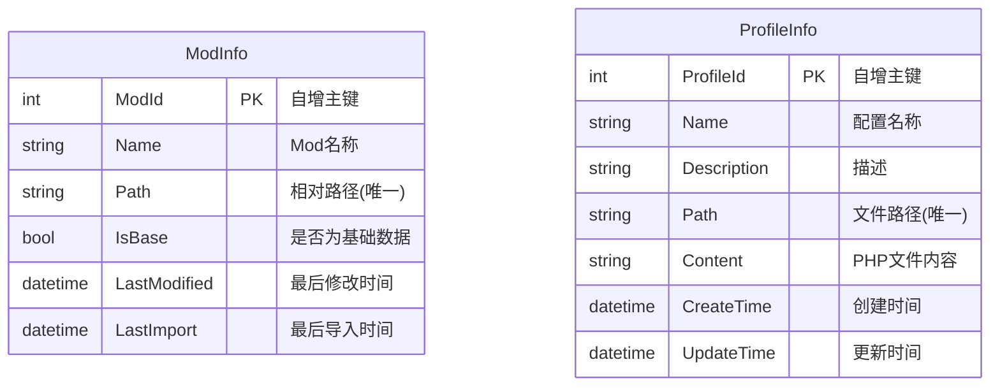

### 3.4 GameDbContext — 24 张游戏数据表

```mermaid
erDiagram
    IEntity {
        string EntityId PK
        int ModId
        string FilePath
    }

    AttackMode ||--|| IEntity : inherits
    BarterHex ||--|| IEntity : inherits
    BattleMove ||--|| IEntity : inherits
    CampType ||--|| IEntity : inherits
    ChargeProfile ||--|| IEntity : inherits
    Condition ||--|| IEntity : inherits
    ContainerType ||--|| IEntity : inherits
    Creature ||--|| IEntity : inherits
    CreatureSource ||--|| IEntity : inherits
    DataFile ||--|| IEntity : inherits
    DmcPlace ||--|| IEntity : inherits
    Encounter ||--|| IEntity : inherits
    EncounterTrigger ||--|| IEntity : inherits
    Faction ||--|| IEntity : inherits
    ForbiddenHex ||--|| IEntity : inherits
    GameVar ||--|| IEntity : inherits
    Headline ||--|| IEntity : inherits
    HexType ||--|| IEntity : inherits
    Ingredient ||--|| IEntity : inherits
    ItemProp ||--|| IEntity : inherits
    ItemType ||--|| IEntity : inherits
    Map ||--|| IEntity : inherits
    Recipe ||--|| IEntity : inherits
    TreasureTable ||--|| IEntity : inherits
```

---

## 4. 核心数据流

### 4.1 Mod 导入流程

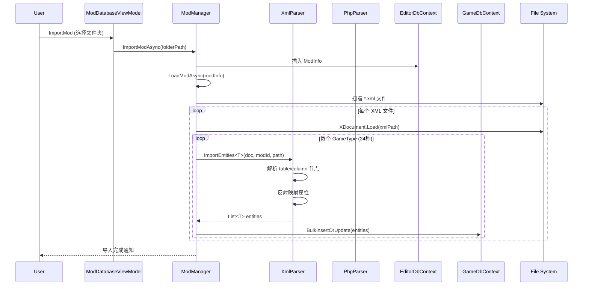

### 4.2 XML 解析机制

`XmlParser` 使用泛型反射方式解析 XML：

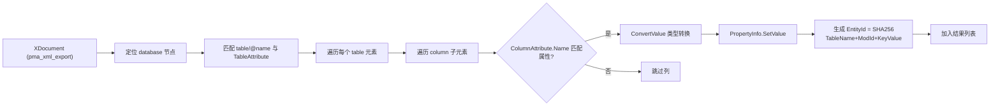

类型转换规则：

-   `string` → 直接返回
-   `int` → `int.Parse()`
-   `float` → `float.Parse(CultureInfo.InvariantCulture)`
-   `bool` → `"1"` 或 `"true"` → `true`
-   `Enum` → `Enum.Parse()`

### 4.3 PHP 配置解析

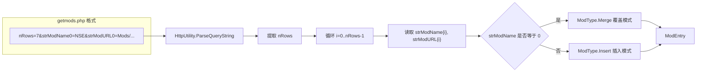

---

## 5. 游戏内引用系统（modName:modId）

> 详细设计文档: [14-reference-resolution-system.md](14-reference-resolution-system.md)

### 5.1 引用格式

游戏中不同数据实体间的引用使用 `modName:modId` 格式，例如 `NSE:42` 或 `0:152`：

```
ItemType.nTreasureID = "8"       → 引用 TreasureTable.id=8 (默认命名空间)
ItemType.aAttackModes = "10"     → 引用 AttackMode.id=10
Recipe.strTools = "1x1"          → 成分数量x成分ID
Creature.nFaction = "NSE:5"      → 引用 Faction.id=5 (NSE命名空间)
Condition.vIDNext = "12,13"      → 逗号分隔的多目标引用
AttackMode.vAttackerConditions = "211x1.0,NSE:42x1"
                                 → 混合引用：条件IDx倍率
```

### 5.2 命名空间规则

```
"0" 或 省略  → 游戏基础命名空间（data/ 目录下的数据）
"NSE", "FoD" 等 → AddOn Mod 的内部名称（strModName）
```

### 5.3 实际实现的四层架构

```
┌──────────────────────────────────────────────┐
│ 元数据层: [ReferenceField] Attribute           │
│   声明: 目标类型 / 分隔符 / 解析模式(TargetKey)  │
├──────────────────────────────────────────────┤
│ 解析层: ReferencePattern (策略) + ReferenceHelper │
│   5种格式策略: Id / IdXMult / MultXId /          │
│   IdEqualsValue / BracketId                     │
├──────────────────────────────────────────────┤
│ 编排层: GenericDataGridHelper                   │
│   FindBestMatch() — 反射匹配实体                 │
│   NavigateToReferenceForce() — 跳转+Peek        │
│   ConfigureColumn() — 引用列 UI 模板生成         │
├──────────────────────────────────────────────┤
│ 事件层: SearchableDataGrid                      │
│   Ctrl 键追踪 / Tapped 导航 / ContextRequested   │
│   Peek                                                  │
└──────────────────────────────────────────────┘
```

### 5.4 核心组件

| 组件 | 文件 | 职责 |
|------|------|------|
| `[ReferenceField]` | `Helper/ReferenceFieldAttribute.cs` | 标记属性为引用字段，声明 TargetEntityType / Separator / Pattern / TargetKey / SecondaryTarget |
| `ReferencePattern` | `Helper/ReferencePattern.cs` | 策略模式，5 种格式的 ID 提取 + 显示格式化 |
| `ReferenceHelper` | `Helper/ReferenceHelper.cs` | 纯函数工具集：ParseReference / DecomposeId / ExtractRawId / ParseMultiValue |
| `GenericDataGridHelper` | `Helper/GenericDataGridHelper.cs` | 核心编排：FindBestMatch（反射匹配）、导航路由、列配置（1056 行） |
| `SearchableDataGrid` | `Views/UserControls/SearchableDataGrid.axaml.cs` | DataGrid 事件层：Ctrl 键追踪、Tapped/Ctrl+RightClick 触发导航 |

### 5.5 引用格式模式

| 模式 | Pattern 配置 | 示例 | 说明 |
|------|-------------|------|------|
| 简单ID | `{id}` (默认) | `"8"`, `"NSE:42"` | 单个ID，可选命名空间前缀 |
| IDx倍率 | `{id}x{mult}` | `"211x1.0"` | ID后跟x倍率 |
| 数量xID | `{mult}x{id}` | `"1x2"` | 数量前置于ID（配方专用） |
| ID=值 | `{id}={value}` | `"38=1"` | ID赋值格式 |
| 方括号ID | `[{id}` | `"[42,SomeData]"` | 方括号包裹 |
| 多值 | `Separator=","` | `"12,13,14"` | 逗号/竖线分隔多个目标 |

### 5.6 复合键查找

部分实体的引用使用复合键（如 TreasureTable 用 GroupId+SubgroupId）：

```csharp
[ReferenceField(typeof(TreasureTable), TargetKey = "{GroupId}.{SubgroupId}")]
```
`DecomposeId("86.6", keyInfo)` → `{GroupId:86, SubgroupId:6}`，然后用这两个 key 在目标实体列表中反射匹配。

### 5.7 已知问题

| # | 问题 | 影响 |
|---|------|------|
| 1 | `FindBestMatch` 中 `is int val` 对 long/null 类型失效 | 所有实体匹配，总是跳转到 id=1 |
| 2 | DataGrid 列索引映射：`rowPanel.Children.IndexOf(cell)` 与 `dg.Columns` 不对齐 | 可能读到错误的列属性 |
| 3 | GDH 静态 `_activeMergeStore` 多 DataGrid 竞争 | 多个 DataGrid 同时可见时读到错误 store |

详见 [14-reference-resolution-system.md](14-reference-resolution-system.md) 第七节。

---

## 6. 合并视图编辑架构（核心新功能）

### 6.1 需求背景

用户通过 `getmods.php` 配置多个Mod的加载顺序后，游戏运行时会合并这些Mod的数据：

-   先加载基础数据（命名空间 `"0"`）
-   按加载顺序依次叠加每个Mod
-   Merge模式Mod（`strModName=0`）覆盖同ID数据
-   Insert模式Mod（`strModName≠0`）追加新数据

编辑器需要支持在**合并后的视图**中编辑，并且改动需要准确**回落到源Mod**上。

### 6.2 合并与回溯模型

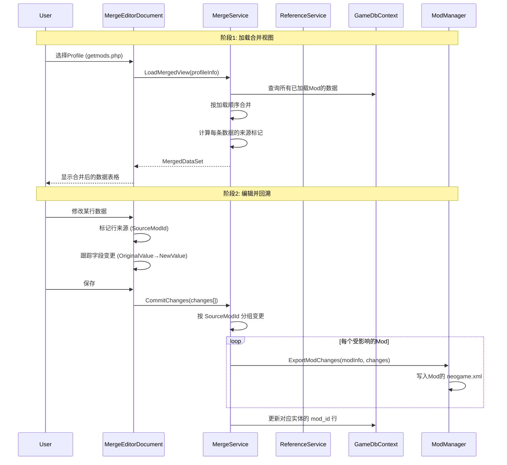

### 6.3 变更归属规则

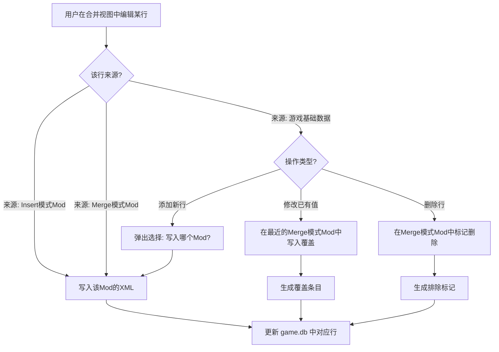

**归属优先级**:

1.  如果该行来自某个Mod → 直接写入该Mod
2.  如果该行来自基础数据且是修改 → 写入加载链中**最后一个Merge模式Mod**
3.  如果该行来自基础数据且是新增 → 弹出选择器让用户选择目标Mod
4.  如果没有Merge模式Mod且要修改基础数据 → 提示用户创建新Mod或选择Insert Mod

### 6.4 合并视图数据模型

```csharp
/// <summary>
/// 合并视图中的一行数据，携带来源信息
/// </summary>
public class MergedEntityRow<T> : ObservableObject where T : IEntity
{
    public T Entity { get; set; }

    /// <summary>数据来源ModId。正数=Mod的ID, -1=基础数据</summary>
    public int SourceModId { get; set; }

    /// <summary>该行在SourceMod中的原始键值</summary>
    public string SourceModName { get; set; }

    /// <summary>该行是否被后续Mod覆盖过（显示时标灰）</summary>
    public bool IsOverridden { get; set; }

    /// <summary>该行是否来自Merge模式Mod（覆盖行为）</summary>
    public bool IsFromOverride { get; set; }

    /// <summary>原始值快照，用于Diff对比</summary>
    public Dictionary<string, object?> OriginalValues { get; set; }

    /// <summary>是否有未保存的更改</summary>
    public bool IsDirty { get; set; }
}
```

### 6.5 冲突检测

当两个Mod修改了同一条数据时，编辑器需要检测并提示用户：

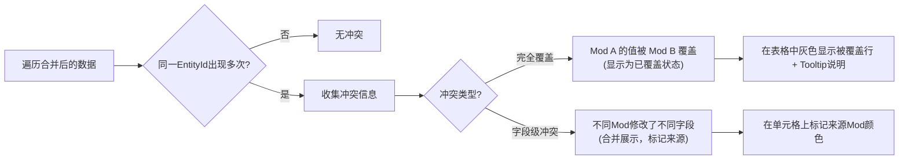

### 6.6 统一引用解析管线

可视化器和 DataGrid 引用列共用同一套解析系统，避免双路径不一致。

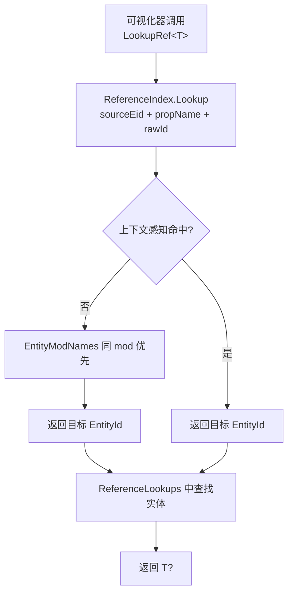

**核心组件**：

| 组件 | 文件 | 职责 |
|------|------|------|
| `ReferenceIndex` | `Helper/ReferenceIndex.cs` | 上下文感知索引：`(sourceEid, propName, rawId)` → `targetEid`。同 mod 优先，全局 MergedId 回退 |
| `EntityMergeStore` | `Services/EntityMergeStore.cs` | 每视图的合并状态，持有 `ReferenceLookups` + `EntityModNames` + `Index` |
| `ReferenceResolver.LookupRef<T>()` | `Helper/ReferenceResolver.cs` | 统一解析入口：优先走 `ReferenceIndex`，回退 `EntityModNames` |
| `GenericDataGridHelper.ActiveMergeStore` | `Helper/GenericDataGridHelper.cs` | 公开当前活跃 Store，让 `LookupRef` 访问索引 |

**数据浏览器引用索引**：

```
EntityBrowserDocument.RebuildBrowserIndexAsync()
  ├── 创建 EntityMergeStore
  ├── 填充 ReferenceLookups（24 类型全量）
  ├── 填充 EntityModNames（EntityId → Mod 名）
  ├── Index.BuildAsync()  ← 构建上下文感知索引
  └── SetActiveStores(store, null)
```

**索引生命周期**：
- 首次数据浏览器打开 → 惰性构建
- 侧边栏 `Rebuild Index` 按钮 → 手动重建
- `SaveProfileMessage` / `RefreshModMessage` / `InitModMessage` / `CellEditedMessage` → 自动失效 → 下次重建

---

## 7. 图片处理管线

### 7.1 getimages.php 编辑流程

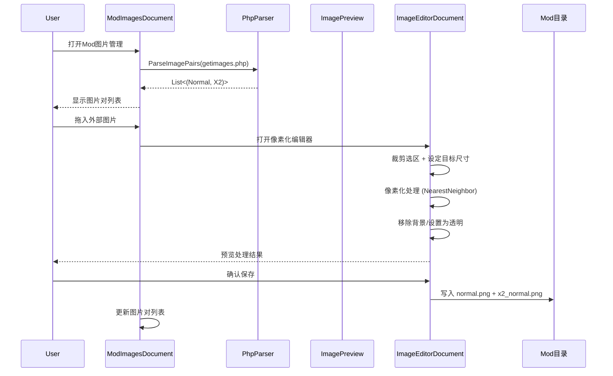

### 7.2 像素化规格

游戏图片要求：

-   每个格子最小尺寸：10×10 px（即 1×1 游戏格子）
-   图片尺寸必须是 10px 的整数倍
-   需要提供两个版本：`image.png` (1x) 和 `x2_image.png` (2x)
-   支持透明背景（PNG格式）

处理流程：

1.  外部导入任意尺寸图片
2.  裁剪到需要的内容区域
3.  缩放到目标格子尺寸（a×10 × b×10 px）
4.  NearestNeighbor 像素化（保持像素风格）
5.  背景透明化（Alpha通道处理）
6.  输出 normal.png → 再生成 x2 版本（2倍尺寸）

---

## 8. UI 组件树

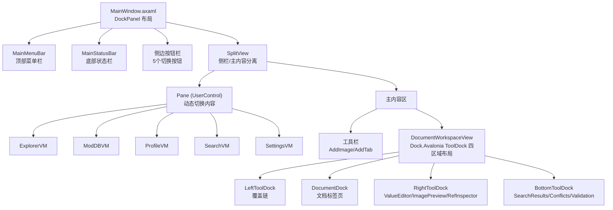

### 8.1 Tool 子类体系 (Dock.Avalonia)

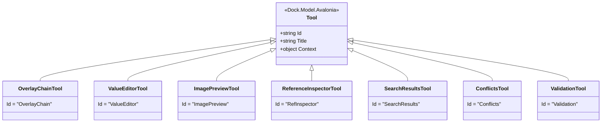

### 8.2 Document 类型体系

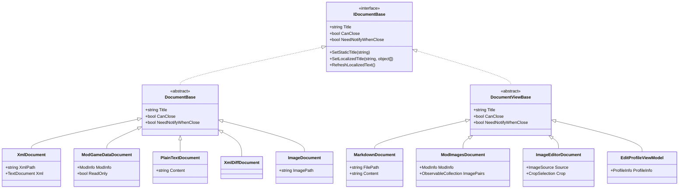

---

## 9. MVVM 消息通信

编辑器使用 `CommunityToolkit.Mvvm.Messaging` 实现 ViewModel 间解耦通信：

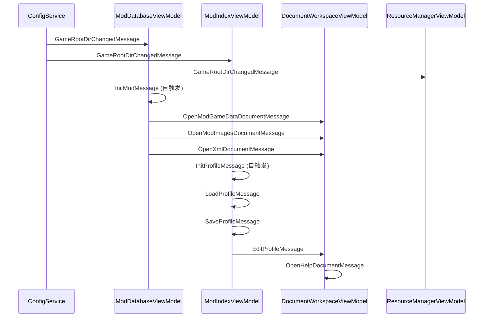

消息类型定义：

-   `GameRootDirChangedMessage(string)` — 游戏根目录变更时广播
-   `InitModMessage` / `RefreshModMessage` — Mod初始化/刷新
-   `OpenModGameDataDocumentMessage(ModInfo)` — 打开Mod数据视图
-   `OpenModImagesDocumentMessage(ModInfo)` — 打开Mod图片管理
-   `OpenXmlDocumentMessage(string, string)` — 打开XML文件
-   `EditProfileMessage(ProfileInfo)` — 编辑Profile
-   `InitProfileMessage` / `LoadProfileMessage` / `SaveProfileMessage` — Profile相关

---

## 10. 服务依赖关系

```mermaid
graph TD
    Host["IHost (.NET Generic Host)"]
    Host --> ConfigSvc["IConfigService<br/>ConfigService (Singleton)"]
    Host --> Localization["LocalizationService (Singleton)"]
    Host --> Notification["INotificationService<br/>NotificationService (Singleton)"]
    Host --> ImgProc["IImageEditorProcessingService<br/>ImageEditorProcessingService (Singleton)"]
    Host --> PhpParser["PhpParser (Singleton)"]
    Host --> XmlParser["XmlParser (Singleton)"]
    Host --> ModMgr["IModManager<br/>ModManager (Singleton)"]
    Host --> ProfileMgr["IProfileManager<br/>ProfileManager (Singleton)"]
    Host --> EditorDBFactory["IDbContextFactory&lt;EditorDbContext&gt;"]
    Host --> GameDBFactory["IDbContextFactory&lt;GameDbContext&gt;"]
    Host --> Messenger["IMessenger<br/>WeakReferenceMessenger (Scoped)"]
    Host --> CsvSvc["CsvImportExportService (Singleton)"]
    Host --> DataExportSvc["DataExportService (Singleton)"]
    Host --> EditorRegistry["CustomEditorRegistry (Singleton)"]
    Host --> ImageSvc["ImageService (Singleton)"]

    ModMgr --> ConfigSvc
    ModMgr --> PhpParser
    ModMgr --> XmlParser
    ModMgr --> EditorDBFactory
    ModMgr --> GameDBFactory

    ProfileMgr --> ConfigSvc
    ProfileMgr --> PhpParser
    ProfileMgr --> EditorDBFactory
```

---

## 11. 关键设计决策

### 11.1 为什么使用 SQLite 而非直接编辑 XML

1.  **查询性能**: 游戏数据量大（如 encounters.xml 2264条记录），SQLite 提供索引和高效查询
2.  **Mod 叠加解析**: 需要在导入时解析 Mod 间的覆盖关系（命名空间 Merge vs Insert）
3.  **数据完整性**: 关系型数据库可以建立外键约束和唯一性检查
4.  **数据来源追踪**: `mod_id` + `file_path` 字段追踪每条数据的来源
5.  **合并视图回溯**: 编辑合并视图后，必须能回溯到源Mod

### 11.2 ModType 设计

```
Insert (命名空间≠"0") → 主键自增，添加全新数据
Merge  (命名空间="0")  → 覆盖同名主键的现有数据
```

### 11.3 反射驱动的 XML 解析

通过 `[Table]`, `[Column]`, `[Index]` 等 EF Core 注解同时驱动数据库映射和 XML 解析，避免重复配置：

```
TableAttribute.Name → XML table/@name → DB table name
ColumnAttribute.Name → XML column/@name → DB column name
IndexAttribute → XML key column → DB unique constraint
```

### 11.4 主键列名适配

不同数据实体使用不同的主键列名，通过 `[Index]` 属性的 `PropertyNames` 声明：

```csharp
// Recipe 使用 nID 作为主键
[Table("recipes")]
[Index(nameof(EntityId), nameof(Id), IsUnique = true)]
public class Recipe : IEntity
{
    [Column("nID")]  // ← 主键列名是 nID，不是 id
    public int Id { get; set; }
}

// AttackMode 使用 id 作为主键
[Table("attackmodes")]
[Index(nameof(EntityId), nameof(Id), IsUnique = true)]
public class AttackMode : IEntity
{
    [Column("id")]   // ← 主键列名是 id
    public int Id { get; set; }
}
```

`XmlParser.ResolveEntityKeyColumnName()` 通过反射获取 `[Index]` 属性中声明的第一个非 `EntityId` 属性名来确定主键列。

---

## 12. 可扩展性设计

### 12.1 模块化架构

编辑器设计为面向接口的模块化架构，便于扩展：

```
┌─────────────────────────────────────────────┐
│               Plugin / Extension API          │
│  ┌──────────┐ ┌──────────┐ ┌──────────────┐ │
│  │ 数据导出器 │ │ 数据导入器 │ │ 自定义编辑器  │ │
│  │ (IExporter)│ │(IImporter)│ │(ICustomEditor)│ │
│  └──────────┘ └──────────┘ └──────────────┘ │
└─────────────────────────────────────────────┘
```

### 12.2 数据导出接口

为"从数据源导出特定数据结果"（如合成表、物品大全等）设计接口：

```csharp
/// <summary>
/// 数据导出器接口 — 允许扩展各种导出格式
/// </summary>
public interface IDataExporter
{
    string Name { get; }
    string Description { get; }
    string OutputFormat { get; }       // "csv", "markdown", "html", "json"
    string FileExtension { get; }

    /// <summary>导出指定类型的数据</summary>
    Task<string> ExportAsync<T>(IEnumerable<T> entities, ExportOptions options)
        where T : IEntity;

    /// <summary>是否支持该实体类型的导出</summary>
    bool SupportsType(Type entityType);
}

/// <summary>
/// 预置导出器示例
/// </summary>
// RecipeCsvExporter   — 导出所有合成配方为CSV表格
// ItemWikiExporter    — 导出物品大全为Markdown/Wiki格式
// TreasureTableExporter — 导出战利品表为嵌套JSON
// EncounterTreeExporter — 导出剧情树为结构化文档
```

### 12.3 自定义编辑器接口

```csharp
/// <summary>
/// 允许为特定数据类型注册专用编辑器（替代通用DataGrid）
/// </summary>
public interface ICustomTableEditor
{
    /// <summary>目标实体类型</summary>
    Type EntityType { get; }

    /// <summary>编辑器名称</summary>
    string Name { get; }

    /// <summary>创建编辑器View</summary>
    Control CreateEditor(MergedEntityRow<IEntity>[] rows, EditSession session);
}
```

应用场景：

-   `RecipeVisualEditor` — 配方可视化编辑器（A+B→C）
-   `MapHexEditor` — 地图六边形网格编辑器
-   `EncounterTreeEditor` — 剧情树可视化编辑器
-   `FactionRelationEditor` — 阵营关系矩阵编辑器

### 12.4 推荐第三方库

| 用途 | 推荐库 | 说明 |
|------|--------|------|
| MVVM框架 | `CommunityToolkit.Mvvm` | 已在用，继续使用 |
| ORM | `EF Core + EFCore.BulkExtensions` | 已在用 |
| XML处理 | `System.Xml.Linq` (XDocument) | 已在用，性能足够 |
| 差异对比 | `DiffPlex` + `XMLDiffPatch` | 已在用 |
| 像素画处理 | `SixLabors.ImageSharp` | 已在用 |
| CSV导出 | `CsvHelper` | 高性能CSV读写 |
| 数据验证 | `FluentValidation` | 链式API，比DataAnnotations更灵活 |
| 命令模式 | `System.Windows.Input.ICommand` | 已在用，考虑引入 `ReactiveUI` 的 `ReactiveCommand` |
| 图表/可视化 | `LiveChartsCore` 或 `ScottPlot` | 数据可视化（如掉率分布图） |
| 属性面板 | `Avalonia.PropertyGrid` | 类似IDE的属性编辑器 |
| 图标 | `FluentIcons.Avalonia` | 已在用 |
| 压缩 | `System.IO.Compression` | 内置，用于Mod打包 |
| Markdown渲染 | `Markdown.Avalonia` | 已在用 |
| 可排序DataGrid | `TreeDataGrid.Avalonia` | 已在项目依赖中（可替换部分DataGrid场景） |

Excel读写

EPPlus

游戏数据本身是XML，不需要Excel

### 12.5 未来扩展方向

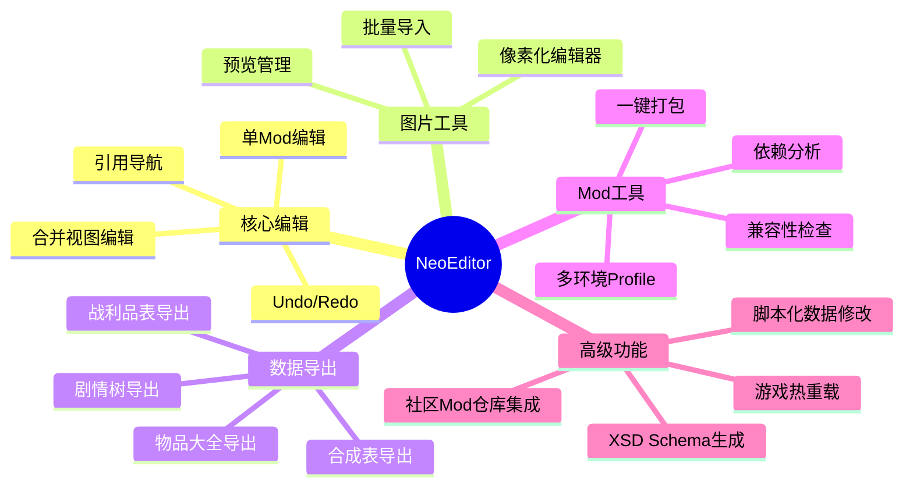