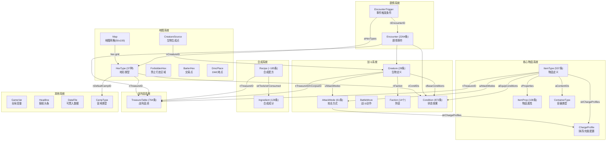
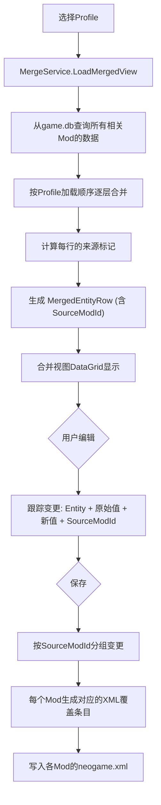
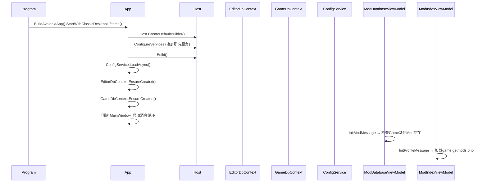
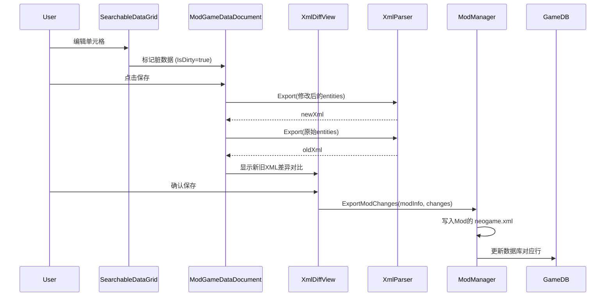
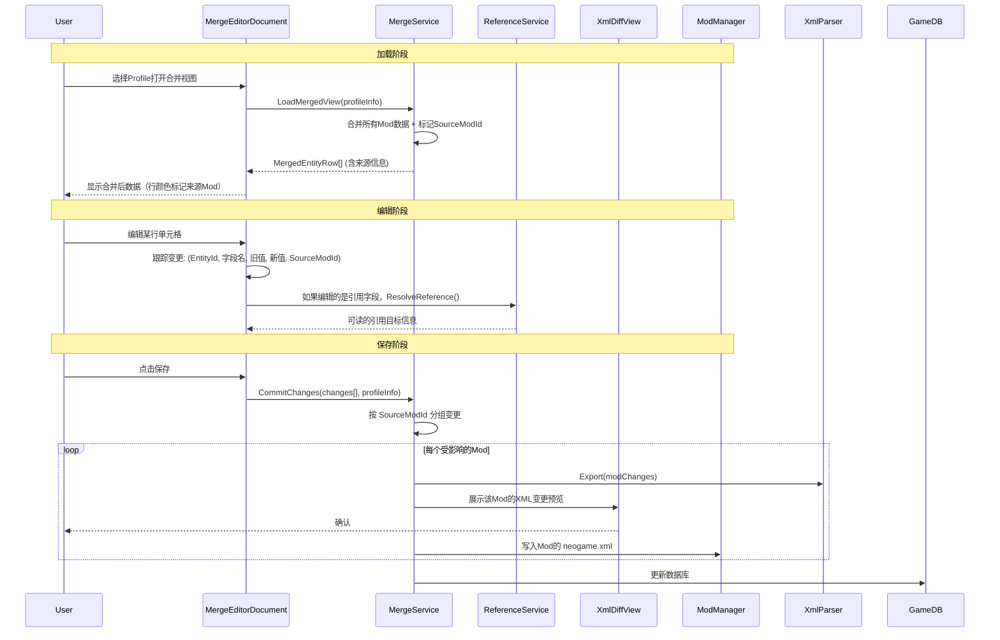

# NeoEditor 模块大纲

## 1. 模块总览

```
NeoEditor/
├── Program.cs                     # 应用入口
├── App.axaml / App.axaml.cs       # Avalonia 应用初始化 & DI 配置
├── ViewLocator.cs                 # View-ViewModel 自动匹配
│
├── Data/                          # 数据层
│   ├── Constants.cs               # 全局常量 & 反射表发现
│   ├── Exceptions.cs              # 自定义异常
│   ├── Context/                   # EF Core DbContext
│   │   ├── EditorDbContext.cs     # 编辑器元数据库
│   │   └── GameDbContext.cs       # 游戏数据(24表) + 动态BulkInsert
│   ├── Model/                     # 数据模型
│   │   ├── ModInfo.cs             # Mod元数据 + ModType枚举
│   │   ├── ProfileInfo.cs         # Mod加载配置
│   │   ├── GameEnum.cs            # 游戏枚举(AttackType/ConditionColor等)
│   │   └── Game/                  # 25个游戏数据实体 (详见下方)
│   ├── DTO/                       # 数据传输对象
│   │   ├── ProjectSettings.cs     # 项目设置 + ModEntry
│   │   └── LanguageInfo.cs        # 语言信息
│   ├── Messages/                  # MVVM消息定义
│   │   ├── AppConfigMessages.cs   # GameRootDirChanged
│   │   ├── GameFolderMessages.cs  # 游戏文件夹消息
│   │   ├── ModMessages.cs         # Mod/XML/Image文档打开
│   │   ├── ProfileMessage.cs      # Profile生命周期
│   │   └── HelpMessages.cs        # 帮助文档打开
│   ├── Options/
│   │   └── CultureSettings.cs     # 多语言配置选项
│   ├── Command/                   # 撤销/重做命令系统
│   │   ├── IEditorCommand.cs      # 命令接口
│   │   ├── ICommandHistory.cs     # 历史管理器接口
│   │   ├── CommandHistory.cs      # 撤销/重做栈 (上限100步)
│   │   ├── EditCellCommand.cs     # 单元格编辑命令
│   │   ├── AddEntityCommand.cs    # 新增实体命令
│   │   ├── DeleteEntityCommand.cs # 删除实体命令
│   │   └── BatchEditCommand.cs    # 批量编辑命令 (替换全部原子撤销)
│   └── Validation/                # 数据验证 (代码存在，未接入保存流程)
│
├── Services/                      # 服务层
│   ├── ConfigService.cs           # JSON配置读写
│   ├── LocalizationService.cs     # 多语言切换 & 资源查找
│   ├── ModManager.cs              # Mod CRUD (导入/创建/加载/删除/ZIP打包)
│   ├── ProfileManager.cs          # Profile CRUD & Mod加载配置解析
│   ├── NotificationService.cs     # 窗口通知(成功/警告/错误)
│   ├── ProjectDbContextFactory.cs # GameDbContext 动态工厂
│   ├── ImageEditorProcessingService.cs  # 图像编辑处理
│   ├── IImageEditorProcessingService.cs # 图像编辑接口
│   ├── CsvImportExportService.cs  # CSV导入导出
│   ├── DataExportService.cs       # 合成表/物品百科/战利品表/XLSX导出
│   ├── CustomEditorRegistry.cs    # 可视化编辑器注册表
│   ├── EntityMergeStore.cs        # 每个标签页的合并状态容器
│   ├── EditTrackingStore.cs       # 每个标签页的编辑追踪
│   ├── FilterService.cs           # 行级过滤 (col:value / 全文搜索)
│   └── ImageService.cs            # 图片搜索 + 配对启发式
│
├── ViewModels/                    # 视图模型层
│   ├── ViewModelBase.cs           # 基础VM (ObservableRecipient)
│   ├── AppConfig.cs               # 应用全局配置VM
│   ├── MainWindowViewModel.cs     # 主窗口VM
│   ├── MainWindowSideBarViewModel.cs  # 侧栏VM
│   ├── HelpMenuNode.cs            # 帮助菜单树节点
│   │
│   ├── MainContent/               # 主内容区文档VM
│   │   ├── Documents.cs           # 文档基类 & 各种Document类型 + 7个Tool子类
│   │   ├── DocumentWorkspaceViewModel.cs  # 文档工作区 (Dock管理 + 7 Tool属性)
│   │   ├── EditProfileViewModel.cs    # Profile编辑
│   │   ├── ImageEditorDocument.cs     # 像素画编辑器
│   │   ├── ModImagesDocument.cs       # Mod图片管理
│   │   └── ImageCropSelection.cs      # 裁剪选区模型
│   │
│   ├── ExplorerPane/              # 侧栏面板VM
│   │   ├── ResourceManagerViewModel.cs  # 文件浏览器
│   │   ├── SearchPaneViewModel.cs       # 搜索面板
│   │   ├── SettingsPaneViewModel.cs     # 设置面板
│   │   ├── ModDatabaseViewModel.cs      # Mod数据库管理
│   │   └── ModIndexViewModel.cs         # Profile/加载配置管理
│   │
│   └── Dialog/                    # 对话框VM
│       ├── CreateModDialogViewModel.cs      # 创建Mod对话框
│       └── RenameImagePairDialogViewModel.cs # 重命名图片对
│
├── Views/                         # 视图层 (Avalonia AXAML)
│   ├── MainWindow.axaml (+.axaml.cs)  # 主窗口
│   ├── UserControls/              # 用户控件
│   │   ├── Pane.axaml             # 侧栏内容容器
│   │   ├── DocumentWorkspaceView.axaml  # 文档停靠面板 (ToolDock 四区域布局)
│   │   ├── EditProfileView.axaml        # Profile编辑视图
│   │   ├── MainMenuBar.axaml            # 菜单栏
│   │   ├── MainStatusBar.axaml          # 状态栏
│   │   ├── ModGameDataTabsView.axaml    # 游戏数据Tab视图
│   │   ├── SearchableDataGrid.axaml     # 可搜索数据表格
│   │   ├── XmlDiffView.axaml            # XML差异对比视图
│   │   ├── ModImagesDocumentView.axaml  # Mod图片管理视图
│   │   ├── ImageEditorDocumentView.axaml # 图像编辑视图
│   │   ├── HomePage.axaml               # 首页入口 (Browse/New/Import)
│   │   ├── OverlayChainToolView.axaml   # 覆盖链工具面板 (左 ToolDock)
│   │   ├── ValueEditorPanel.axaml       # 可视化编辑器面板 (右 ToolDock Tab1)
│   │   ├── ImagePreviewView.axaml       # 图片预览面板 (右 ToolDock Tab2)
│   │   ├── ReferenceInspectorView.axaml # 引用检查器 (右 ToolDock Tab3)
│   │   ├── SearchResultsView.axaml      # 搜索结果面板 (底 ToolDock Tab1)
│   │   ├── ConflictsView.axaml          # 冲突列表面板 (底 ToolDock Tab2)
│   │   ├── ValidationView.axaml         # 验证报告面板 (底 ToolDock Tab3)
│   │   ├── DomainBrowserView.axaml      # 数据浏览器 (ListBox + TabControl)
│   │   ├── EntityViewerView.axaml       # 实体查看器 (Visualizer 渲染容器)
│   │   ├── FindReplacePanel.axaml       # 查找替换面板
│   │   ├── ZoomableImageView.axaml      # 可缩放图片视图
│   │   └── Editors/                     # 可视化编辑器目录
│   └── Dialog/                    # 对话框视图
│       ├── CreateModDialog.axaml
│       ├── RenameImagePairDialog.axaml
│       └── ModGameDataSavePreviewDialog.axaml
│
├── Helper/                        # 工具类
│   ├── PhpParser.cs               # getmods.php / getimages.php 解析&生成
│   ├── XmlParser.cs               # XML 导入/导出 (泛型反射)
│   ├── ReflectionHelper.cs        # 反射工具 (属性名获取)
│   ├── Sha256Helper.cs            # EntityId 生成
│   ├── GenericDataGridHelper.cs   # DataGrid 列自动生成 + 引用导航
│   ├── ReferenceHelper.cs         # 引用字符串解析/格式化
│   ├── ReferencePattern.cs        # 引用 Pattern 策略 (5 个实现)
│   ├── ReferenceResolver.cs       # 引用解析/去重/反向引用
│   ├── ReferenceFieldAttribute.cs # [ReferenceField] 标注属性
│   ├── ICustomTableEditor.cs      # 可视化编辑器接口
│   ├── EditorUIFactory.cs         # TreeViewItem/TabControl 工厂
│   ├── HexMapRenderer.cs          # 六边形地图 Bitmap 渲染
│   ├── OverlayChainEntry.cs       # 覆盖链节点模型
│   ├── XmlCompareHelper.cs        # XML Diff 比较
│   ├── Attributes.cs              # (空占位)
│   ├── Converter/                 # 值转换器 (8 个)
│   ├── Extensions/                # 扩展方法
│   ├── DragDropHandler/           # 拖放处理
│   ├── AttachedProperties/        # 附加属性
│   ├── Behaviors/                 # 行为
│   └── ImageEditor/               # 图像编辑辅助工具
│
├── Assets/                        # 资源文件
│   ├── Resources.resx / .zh.resx / .en-us.resx
│   └── 字体/图标
│
├── Help/                          # 帮助文档
│   ├── zh/Welcome.md
│   └── en/aa.md
│
├── Docs/                          # 项目文档
├── Templates/                     # (空占位 — 预留给项目模板)
└── appsettings.json               # 应用配置
```

---

## 2. 游戏数据实体详解

24 种游戏表类型及其关系：



### 2.1 各表核心字段摘要

| 表名 | DB表名 | 关键字段 | 数据量 |
|------|--------|---------|--------|
| AttackMode | `attackmodes` | nRange, fDamageCut/Blunt, nPenetration, nType | 61 |
| BarterHex | `barterhexes` | 坐标, 买卖物品列表 | ~20 |
| BattleMove | `battlemoves` | 战斗动作名称, 图片, 效果 | ~30 |
| CampType | `camptypes` | 营地名称, 图标, 条件 | ~20 |
| ChargeProfile | `chargeprofiles` | 弹药类型, 消耗物品 | ~30 |
| Condition | `conditions` | aFieldNames, aModifiers, fDuration, bFatal | 872 |
| ContainerType | `containertypes` | 容器容量, 可装物品类型 | ~15 |
| Creature | `creatures` | 名称, 阵营, 战利品, 基础状态 | 28 |
| CreatureSource | `creaturesources` | 坐标, 生成生物ID | ~30 |
| DataFile | `datafiles` | 名称, 内容, 破解难度 | 88 |
| DmcPlace | `dmcplaces` | 名称, 坐标, 交互内容 | ~25 |
| Encounter | `encounters` | 剧情文本, 选项, 奖励, 坐标 | 2264 |
| EncounterTrigger | `encountertriggers` | 触发条件, 时间/位置限制 | ~100 |
| Faction | `factions` | 阵营名, 外交关系矩阵 | 14 |
| ForbiddenHex | `forbiddenhexes` | 禁止通行坐标 | ~30 |
| GameVar | `gamevars` | 全局变量名, 值 | ~15 |
| Headline | `headlines` | 报纸内容, 触发条件 | ~30 |
| HexType | `hextypes` | 名称, 移动消耗, 可见度, 搜刮表 | 37 |
| Ingredient | `ingredients` | 所需属性, 禁止属性 | 128 |
| ItemProp | `itemprops` | 属性名 (如 "rigid", "flammable") | 108 |
| ItemType | `itemtypes` | 名称, 重量, 属性, 装备槽, 战利品ID | 537 |
| Map | `maps` | 50x100 地形ID网格 | 1 |
| Recipe | `recipes` | 配方名, 工具, 消耗, 产物战利品ID | ~185 |
| TreasureTable | `treasuretable` | 战利品列表, 嵌套, 抑制 | 764 |

---

## 3. 功能模块详细描述

### 3.1 Mod 管理模块

**负责**: `ModManager` + `ModDatabaseViewModel`

```
功能清单:
├── [已实现] ImportMod — 导入Mod文件夹到编辑器数据库
├── [已实现] CreateMod — 创建新Mod（目录+getimages.php+neogame.xml）
├── [已实现] LoadMod — 将Mod的XML数据解析到GameDbContext
├── [已实现] DeleteMod — 删除Mod（目录+数据库记录）
├── [已实现] ExportMod — 导出修改后的数据为Mod XML + Diff预览
├── [已实现] Mod打包 — 导出/导入为可分发的.zip文件
├── [已实现] 显示Mod详情（XML文件列表、图片列表）
├── [已实现] CSV导入导出（ModDatabase 右键菜单）
└── [未实现] Mod依赖检查 — 检测Mod间的命名空间依赖
```

### 3.2 多环境 Profile 管理模块 (getmods.php 编辑)

**负责**: `ProfileManager` + `ModIndexViewModel` + `EditProfileViewModel`

getmods.php 是实现"多环境配置"的核心——用户可以有多个Profile，每个Profile指定不同的Mod加载顺序和命名空间。编辑器需要让用户：

1. 创建/编辑/删除Profile（切换不同的Mod组合）
2. 编辑每个Profile中Mod的加载顺序
3. 配置每个Mod的命名空间（strModName）
4. 管理Mod文件夹路径（strModURL）

```
功能清单:
├── [已实现] ImportProfile — 导入 getmods.php 文件
├── [已实现] CreateProfile — 创建空白Profile（空Mod列表）
├── [已实现] EditProfile — 编辑Mod加载列表（表格编辑）
├── [已实现] DeleteProfile — 删除Profile
├── [已实现] Profile展开 — 解析并显示mod加载列表
├── [已实现] Mod加载状态可视化（Insert/Merge/Unknown，不同颜色图标）
├── [已实现] 生成 getmods.php 内容（PhpParser.GenerateModsPhp）
├── [已实现] 拖拽排序Mod加载顺序
├── [已实现] Profile差异对比（两个Profile加载了哪些不同的Mod）
├── [未实现] MenuFlyout选择已有Mod添加到Profile
├── [未实现] Profile切换时的数据重载
└── [未实现] 多个Profile共存（不同环境：开发/测试/发布）
```

### 3.3 游戏数据编辑模块

**负责**: `ModGameDataTabsView` + `SearchableDataGrid` + `ModGameDataDocument`

这是编辑器的核心编辑区域。有两种编辑模式：

```
功能清单:
├── [已实现] 按表类型分Tab显示数据
├── [已实现] 自动生成DataGrid列（反射ColumnAttribute）— bool→CheckBox, Enum→ComboBox, longtext→多行TextBox
├── [已实现] 单元格内联编辑 + 行增删 + 保存闭环
├── [已实现] 数据搜索/过滤（col:value语法 + 全文搜索 + 200ms防抖）
├── [已实现] XML Diff预览 + 确认写入磁盘
├── [已实现] 引用列：46+ 字段 [ReferenceField] 标注，Ctrl+Click 跳转，右键菜单跳转，ComboBox 编辑
├── [已实现] Undo/Redo 命令系统（Ctrl+Z/Y，上限100步）
├── [已实现] 列管理器（勾选/取消列可见性，持久化到 config.json）
├── [已实现] Ctrl+F/H 查找替换（字段级匹配、正则/全词/大小写、Cell 边框高亮、替换后可撤销）
├── [已实现] 单Mod编辑模式 — 针对一个Mod的数据进行编辑
├── [已实现] 合并视图编辑模式 — 根据Profile合并多个Mod，编辑后变更回落 + 自动写XML
├── [已实现] 字段级来源标记 + 冲突检测（Cell ToolTip 显示来源 / ⚠ CONFLICT）
├── [已实现] 可视化编辑器（Recipe树/Story Graph流程图/TreasureTable战利品树/ItemType装备预览/Condition配对）
├── [已实现] 数据导出（合成表CSV/XLSX、物品百科Markdown、战利品表JSON、全量XLSX）
├── [已实现] 全局搜索模块（所有24实体类型、结果分组、双击跳转）
├── [已实现] 编辑器设置（语言/主题/字体大小/游戏根目录浏览）
├── [未实现] 行内数据验证（必填、类型范围、格式验证）— 代码存在，需改为提示而非阻止
```

### 3.4 合并视图编辑模块 ★

**负责**: `MergeService` + `MergeEditorDocument` + `ReferenceService`

这是连接"多Mod加载"与"数据编辑"的关键桥梁。当用户打开一个Profile时，编辑器不是逐个显示每个Mod的数据，而是将Profile中所有Mod的数据按游戏规则合并展示。



```
功能清单:
├── [已实现] Profile加载 → 合并视图展示（ModGameDataTabsView + ReloadMergeTabsAsync）
├── [已实现] 合并规则引擎：Game 打底 → Merge Mod 同 key 覆盖 → Insert Mod 追加
├── [已实现] 双模式切换：Show All ToggleButton（胜者 / 全量 + 败者浅灰底）
├── [已实现] 覆盖链面板：选中行下方展开，按 load order 排列
├── [已实现] 覆盖链导航：按 EntityId 精确跳转，胜者 Teal 加粗、败者灰色
├── [已实现] 合并自增 ID 列（→Id）：Merge 空间 = 原始 key，Insert 空间 = 顺序自增
├── [已实现] Mod 列：每行显示来源 Mod 名称（单 Mod 视图自动隐藏）
├── [已实现] 字段级来源/冲突标记（Cell ToolTip 显示 Mod 来源或 ⚠ CONFLICT）
├── [已实现] 合并视图编辑 → 增删行 → 变更回落源 Mod + 自动写 XML
├── [已实现] modName:modId 引用解析（命名空间感知匹配、FindBestMatch）
├── [已实现] 可视化编辑器覆盖链集成
└── [未实现] 保存前 Diff 预览（合并视图每个受影响的 Mod 单独展示变更）— DB 直写，Export 按钮可手动触发

### 3.5 像素画编辑模块

**负责**: `ImageEditorDocument` + `ImageEditorProcessingService`

这个模块是将外部图片处理成游戏可用格式的工具。游戏图片要求：尺寸为10px的整数倍、需要 normal + x2 双版本、支持透明背景。

```
处理管线:
外部图片(任意尺寸) → [裁剪选区] → [缩放到 a×10 × b×10 px] → [NearestNeighbor像素化]
→ [背景透明化处理] → [输出 normal.png] → [自动生成 x2_normal.png (2倍)]

功能清单:
├── [已实现] 打开图片并显示 + 元数据展示
├── [已实现] 裁剪选区（9种操作模式：移动/4边/4角，交互式拖拽）
├── [已实现] 目标尺寸以BaseStep=10为步进单位
├── [已实现] 宽高比锁定
├── [已实现] 保存为 normal + x2 图片对
├── [未实现] 背景透明化（去除纯色背景/Alpha通道编辑）
├── [未实现] 调色板编辑（限制颜色数量，保持像素风格）
├── [未实现] 像素级手绘（画笔/橡皮擦/填充/取色工具）
└── [未实现] 从游戏内图片反推回像素尺寸编辑
```

### 3.6 Mod 图片管理模块 (getimages.php 编辑)

**负责**: `ModImagesDocument` + `PhpParser`

这个模块让用户配置 Mod 的 `getimages.php`，管理 normal + x2 图片对。处理完成后保存为符合游戏格式的 PHP 配置文件。

> 注意：getimages.php 的格式是先全部 normal 图片，再全部同名的 x2 图片交叉排列：`img1.png, x2_img1.png, img2.png, x2_img2.png, ...`

```
功能清单:
├── [已实现] 解析 getimages.php 获取图片对列表
├── [已实现] 显示图片对（normal + x2 成对展示 + 缩略图 + 全尺寸预览）
├── [已实现] 导入/添加图片对（文件选择器，支持 PNG/JPG/BMP/GIF/WebP）
├── [已实现] 删除图片对
├── [已实现] 重命名图片对（对话框 + 预览）
├── [已实现] 拖拽排序（改变图片加载顺序）+ 指示器
├── [已实现] 保存并生成 getimages.php（PhpParser.GenerateImagePhp）+ 顺序持久化
├── [已实现] 图片预览缩略图（Normal + X2 均显示尺寸和路径）
├── [已实现] 关闭时有未保存修改拦截
├── [未实现] 图片有效性检查（引用的文件是否实际存在）
├── [未实现] 拖入外部文件直接添加到列表（文件选择器已可用，拖放未实现）
├── [未实现] 通过像素画编辑器创建新图片 → 自动加入列表
└── [未实现] 双击图片对打开像素画编辑
```

### 3.7 资源浏览器模块

**负责**: `ResourceManagerViewModel`

```
功能清单:
├── [已实现] 树形文件浏览器
├── [已实现] 响应游戏目录变更
├── [已实现] 用系统默认程序打开文件
├── [未实现] 右键菜单（删除/重命名/复制路径）
├── [未实现] 文件图标
└── [未实现] 文件过滤（仅显示特定类型）
```

### 3.8 搜索模块

**负责**: `SearchPaneViewModel`

```
功能清单:
├── [已实现] 全局搜索：遍历全部24种实体类型，匹配所有string属性
├── [已实现] 支持 col:value 列筛选语法
├── [已实现] 搜索结果按实体类型分组，双击跳转到目标实体
├── [已实现] 最近搜索历史（最多20条）
├── [已实现] 搜索防抖 + 加载指示器
└── [未实现] 搜索结果导出
```

### 3.9 设置模块

**负责**: `SettingsPaneViewModel` + `ConfigService`

```
功能清单:
├── [已实现] 游戏根目录设置（可编辑 + 浏览按钮）
├── [已实现] 配置持久化 (config.json)
├── [已实现] 语言切换（中文/English）
├── [已实现] 主题切换（Light/Dark/System）
├── [已实现] 字体大小设置
└── [未实现] 更多编辑器偏好（自动保存间隔、默认导出格式等）
```

---

## 4. 数据流关键路径

### 4.1 启动流程



### 4.2 用户编辑数据流程（单Mod模式）



### 4.3 用户编辑数据流程（合并视图模式）★



---

## 5. 当前实现状态矩阵

| 功能领域 | 只读浏览 | 创建 | 编辑 | 删除 | 导入 | 导出 |
|---------|:------:|:---:|:---:|:---:|:---:|:---:|
| Mod管理 | ✓ | ✓ | ✗ | ✓ | ✓ | ✗ |
| Profile/多环境配置 | ✓ | ✓ | ✓ | ✓ | ✓ | ✓ |
| getimages.php 图片配置 | ✓ | ✓ | ✓ | ✓ | ✓ | ✓ |
| 游戏数据 (24表) — 单Mod | ✓ | ✓ | ✓ | ✓ | ✓ | ✓ |
| 合并视图 | ✓ | ✓ | ✓ | ✓ | — | ✓ |
| 引用解析 (modName:modId) | ✓ | — | ✓ | — | — | — |
| 像素画编辑 | ✓ | ✓ | ✓ | — | ✓ | ✓ |
| 数据导出 (合成表/百科/战利品/XLSX) | — | — | — | — | — | ✓ |
| Mod 打包 (.zip) | — | — | — | — | — | ✓ |
| 全局搜索 | — | — | — | — | — | ✓ |
| Profile 差异对比 | — | — | — | — | — | ✓ |
| 编辑器设置 (语言/主题/字体) | — | — | — | — | — | ✓ |

> † 裁剪+像素化处理 + Normal/X2双输出 — 缺少逐像素手绘工具  
> \* "—" = 不适用或未设计
