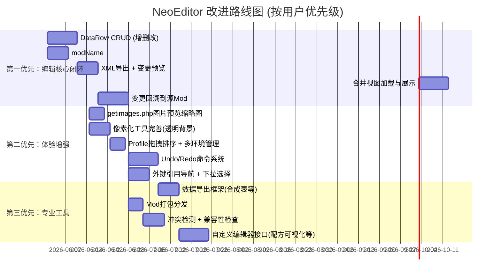
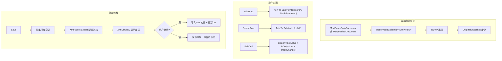
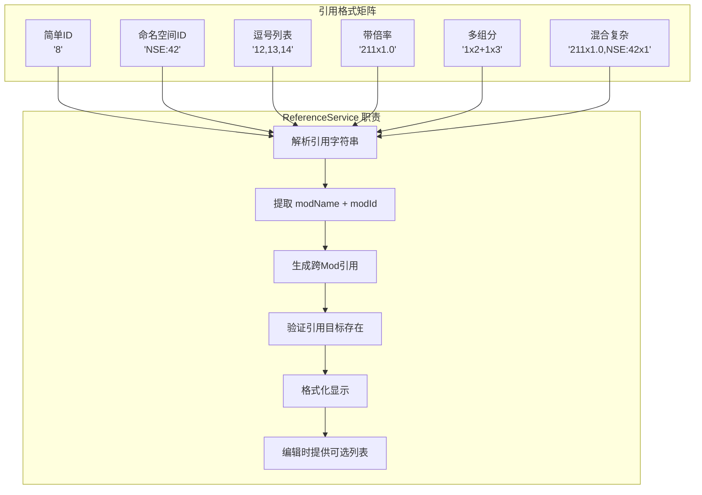
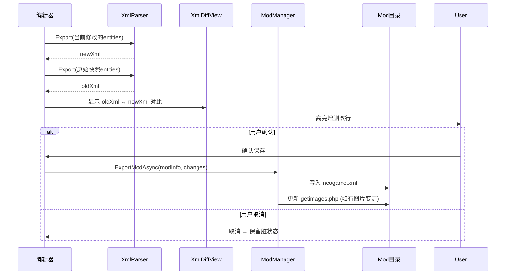
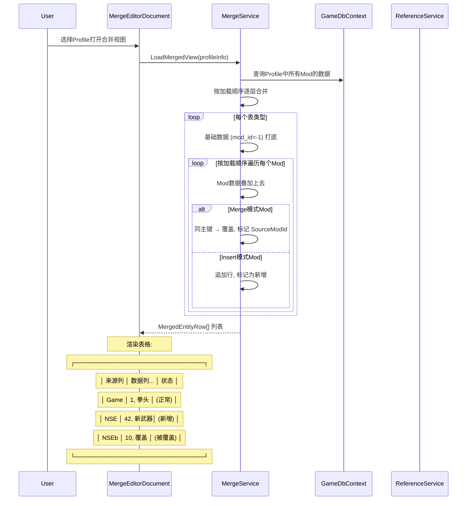

# NeoEditor 改进方案

> **状态更新 (2026-05-30)**：以下 5 个用户目标已全部实现。本文档保留作为历史设计参考。当前剩余工作见 CHANGELOG Stage 7 末尾的"已知限制"。

## 1. 用户目标对照

根据用户明确的五大需求目标，重新梳理改进优先级：

| # | 用户目标 | 对应模块 | 当前状态 |
|---|---------|---------|:------:|
| 1 | 编辑 getmods.php 支持多环境配置 | Profile管理 + EditProfile | ✅ 已实现 |
| 2 | 编辑 getimages.php + 图片预览 + 像素化工具 | ModImages + ImageEditor | ✅ 已实现（缩略图/预览/拖拽排序均有；缺像素手绘工具） |
| 3 | 低摩擦Mod导入 + 导出预览变更 | ModManager(导入) + 合并视图(导出) | ✅ 已实现（含 .zip 打包） |
| 4 | 合并视图编辑 + 变更回溯到源Mod ★ | MergeService | ✅ 已实现（含自动写 XML） |
| 5 | 可扩展性 + 数据导出（如合成表） | DataExportService | ✅ 已实现（CSV/XLSX/Markdown/JSON） |

---

## 2. 改进路线图（修订版）



---

## 3. 第一优先：编辑核心闭环

### 3.1 DataRow CRUD — 让数据可编辑

**这是把编辑器从"只读"变为"可用"的最关键一步。**



**关键实现点**:

1. **利用 `Data/Command/` 目录**（已预留），实现命令模式：
   ```csharp
   public interface IEditorCommand
   {
       void Execute();
       void Undo();
       string Description { get; }

       // 合并视图需要：记录源Mod
       int? SourceModId { get; }
       Type EntityType { get; }
   }

   public class AddEntityCommand<T> : IEditorCommand where T : IEntity, new() { ... }
   public class DeleteEntityCommand<T> : IEditorCommand where T : IEntity { ... }
   public class EditPropertyCommand : IEditorCommand { ... }
   ```

2. **DataGrid 列类型映射** — 使用 `DataGridTemplateColumn` 根据字段类型选择编辑器：
   | .NET类型 | 编辑器控件 | 示例字段 |
   |---------|-----------|---------|
   | `bool` | CheckBox | `bFatal`, `bStackable` |
   | `Enum` | ComboBox | `nType`, `nColor` |
   | `string` (`varchar`) | TextBox | `strName` |
   | `string` (`longtext`) | MultiLine TextBox | `strDesc`, `aEffects` |
   | `int` | NumericUpDown | `nRange`, `id` |
   | `double` | NumericUpDown (float) | `fWeight`, `fDuration` |
   | **引用字段** ★ | SearchableComboBox | `nFaction`, `nTreasureID` |

### 3.2 modName:modId 引用解析服务 ★

**这是编辑器区别于普通数据库工具的核心特性。** 游戏中的引用使用 `modName:modId` 格式（如 `NSE:42`, `0:152`），需要专门的服务来解析。



**实现方案**:

```csharp
public interface IReferenceService
{
    /// <summary>解析引用字符串</summary>
    IReadOnlyList<ModReference> Parse(string raw, ReferenceFormat format);

    /// <summary>查找引用目标</summary>
    T? Resolve<T>(ModReference reference) where T : IEntity;

    /// <summary>格式化引用字符串</summary>
    string Format(IReadOnlyList<ModReference> refs, ReferenceFormat format);

    /// <summary>获取该字段可用的引用值列表（用于编辑器下拉选择）</summary>
    IReadOnlyList<ReferenceOption> GetOptions(Type entityType, string propertyName);

    /// <summary>验证引用完整性</summary>
    ValidationResult Validate(string raw, Type targetType);
}

public enum ReferenceFormat
{
    SimpleId,         // "8"
    NamespacedId,     // "NSE:42"
    CommaList,        // "12,13,14"
    Multiplier,       // "211x1.0"
    QuantityIngredient, // "1x2+1x3"
    MixedMultiplier   // "211x1.0,NSE:42x1"
}
```

**利用 AutoMapper**（项目已引用）来处理不同主键列名的映射：
```csharp
// 不同entity的主键列名差异通过已存的 [Column] 和 [Index] 特性处理
// ReferenceService 通过反射统一获取
var keyProperty = entityType.GetProperties()
    .First(p => p.GetCustomAttribute<ColumnAttribute>()?.Name == "id"
             || p.GetCustomAttribute<ColumnAttribute>()?.Name == "nID");
```

### 3.3 XML 导出与变更预览

**现状**: `XmlParser.Export()` 已实现导出，但缺少编辑→导出→预览→确认的完整流程。



### 3.4 合并视图加载与展示 ★



**UI 表现**:
- 行前添加"来源Mod"列，用不同颜色徽章标识
- 被后续Mod覆盖的行 → 灰色文字 + 删除线 + Tooltip说明
- Merge模式Mod新增的行 → 特殊图标
- 引用字段中的 `modName:modId` → 解析为可点击链接

### 3.5 变更回溯到源Mod ★

```
用户编辑合并视图的某行 → 标记 SourceModId → 用户保存 → 按SourceModId分组 → 每个Mod单独写入

归属规则:
  • 行来源 = Mod A (Insert模式) → 变更写入 Mod A 的 neogame.xml
  • 行来源 = Mod B (Merge模式) → 变更写入 Mod B 的 neogame.xml
  • 行来源 = 基础数据 (mod_id=-1) → 变更写入"最近的Merge模式Mod"
    • 如果加载链中没有Merge模式Mod → 弹出选择器让用户选一个Mod
  • 新增行 → 弹出选择器让用户选择目标Mod
```

```mermaid
flowchart TB
    A[收集所有未保存变更] --> B[按 SourceModId 分组]

    B --> C{SourceModId == -1?}
    C -->|是 (基础数据)| D[寻找加载链中最后一个 Merge 模式 Mod]
    D --> E{找到?}
    E -->|是| F[归入该Merge Mod]
    E -->|否| G[弹窗: 选择目标Mod 或 创建新Mod]
    G --> F

    C -->|否 (来自Mod)| F

    F --> H[每个Mod生成对应的XML覆盖条目]
    H --> I{一个Mod有变更?}
    I -->|有| J[显示该Mod的变更Diff预览]
    J --> K[用户确认后写入 neogame.xml]
    I -->|无变更| L[跳过]
```

---

## 4. 第二优先：体验增强

### 4.1 getimages.php 图片预览

在 `ModImagesDocument` 的图片对列表中显示缩略图：

```csharp
// 使用 SixLabors.ImageSharp 异步生成缩略图
// 建议：使用 SemaphoreSlim 控制并发加载
public async Task<Bitmap?> LoadThumbnailAsync(string imagePath, int maxWidth = 96)
```

### 4.2 像素化工具完善

当前缺少的功能：
- **背景透明化**: 检测并移除纯色背景（如白色、绿色幕布），或手动指定透明色
- **Alpha通道编辑**: 像素画透明通道的逐像素处理
- **从游戏图片反推**: 如果用户想修改已有的游戏图片，应该能一键反推回裁剪编辑尺寸

### 4.3 Profile 多环境管理

```
环境示例:
  • "开发环境" Profile: Game + MyMod + DebugTools
  • "测试环境" Profile: Game + MyMod + NSE
  • "发布环境" Profile: Game + MyMod

切换Profile → 触发 GameRootDirChangedMessage 级别的数据刷新
```

拖拽排序实现：利用 `Xaml.Behaviors.Interactions.DragAndDrop.DataGrid`（已在依赖中）

### 4.4 Undo/Redo 命令系统

使用 `Data/Command/` 目录：
```csharp
public class CommandHistory
{
    private readonly Stack<IEditorCommand> _undoStack = new();
    private readonly Stack<IEditorCommand> _redoStack = new();
    private const int MaxHistory = 100;

    public void Execute(IEditorCommand cmd) { ... }
    public void Undo() { ... }
    public void Redo() { ... }
    public bool CanUndo => _undoStack.Count > 0;
    public bool CanRedo => _redoStack.Count > 0;
}
```

### 4.5 外键引用导航与下拉选择

- **导航**: 点击引用列 → 自动跳转到目标表的对应行
- **选择器**: 编辑引用列时弹出 `SearchableComboBox`，显示 `"{Id}: {Name}"` 格式的可选项
- **过滤**: 支持按 modName 过滤（只显示特定命名空间下的条目）

---

## 5. 第三优先：专业功能

### 5.1 数据导出框架

用户需要"根据规则，从数据源导出某些数据结果，比如合成表"。

```csharp
/// <summary>
/// 可扩展的数据导出器接口
/// </summary>
public interface IDataExporter
{
    string Name { get; }           // "合成表CSV导出"
    string Description { get; }
    string FileExtension { get; }  // ".csv"
    bool SupportsType(Type entityType);
    Task<string> ExportAsync<T>(IEnumerable<T> entities, ExportOptions options);
}

public record ExportOptions
{
    public bool IncludeHeader { get; init; } = true;
    public string? Culture { get; init; }
    public Dictionary<string, string>? FieldMappings { get; init; }
    public Func<IEntity, bool>? Filter { get; init; }
}
```

**预置导出器**:

| 导出器 | 数据源 | 输出格式 | 说明 |
|-------|--------|---------|------|
| RecipeTableExporter | recipes + ingredients + treasuretable | CSV | 完整合成表，包含产物、材料、时间、类型 |
| ItemWikiExporter | itemtypes | Markdown | 物品百科：名称、重量、价格、属性、图片 |
| TreasureTableExporter | treasuretable (递归展开) | JSON | 嵌套战利品树结构 |
| EncounterDialogExporter | encounters | Markdown | 剧情对话树文本导出 |
| ModDiffExporter | 合并视图数据 | XML | 导出某个Mod相对于基础数据的全部差异 |

### 5.2 自定义编辑器接口

为特定表类型提供专用编辑器（替代通用DataGrid）：

```csharp
public interface ICustomTableEditor
{
    Type EntityType { get; }
    string EditorName { get; }
    Control CreateEditor(EditSession session);
    bool IsReadOnly { get; }
}

// 注册：DI 或 属性标记
[CustomEditor(typeof(Recipe))]
public class RecipeVisualEditor : ICustomTableEditor { ... }

[CustomEditor(typeof(Map))]
public class MapHexEditor : ICustomTableEditor { ... }
```

### 5.3 第三方库推荐

| 库 | 用途 | 优先级 |
|----|------|:----:|
| `CsvHelper` | CSV导出（合成表、物品列表等） | 高 |
| `FluentValidation` | 数据验证（链式API比DataAnnotations灵活） | 高 |
| `SixLabors.ImageSharp` | 图片处理 — 已在用 ✓ | — |
| `DiffPlex` | 文本差异对比 — 已在用 ✓ | — |
| `CommunityToolkit.Mvvm` | MVVM框架 — 已在用 ✓ | — |
| `EFCore.BulkExtensions.Sqlite` | 批量数据操作 — 已在用 ✓ | — |
| `Avalonia.PropertyGrid` | 属性面板（类似IDE属性编辑器） | 中 |
| `LiveChartsCore` | 数据可视化图表 | 低 |

---

## 6. 关键设计注意事项

### 6.1 主键列名适配

已在架构文档中详述。关键代码位置：
- `Constants.GameTypes` — 反射发现所有实体类型
- `XmlParser.ResolveEntityKeyColumnName()` — 获取主键列名
- 各实体的 `[Index]` 属性 — 声明哪个属性是业务主键

### 6.2 modName:modId 字符串 vs 数据库 int

```
XML/游戏中:  strModName=0, id=8    → 引用表示为 "8" (默认空间) 或 "0:8"
编辑器DB中:  mod_id=0, entity_id="SHA256" (EntityId是字符串，IntId保持int)

解析时:   "NSE:42" → modName="NSE", modId=42
格式化时: modName="NSE", modId=42 → "NSE:42"
```

ReferenceService 需要处理 Int列中存储 `"NSE:42"` 这类字符串的情况，因为 XML 中的引用字段是文本格式。

### 6.3 减少导入摩擦

- **智能检测**: 导入Mod目录时自动识别 neogame.xml 或 data/*.xml
- **增量导入**: 只重新解析发生变化的XML文件（检查文件修改时间）
- **批量导入**: 一次性导入多个Mod目录
- **自动关联**: 导入Mod时自动关联已有Profile中的条目

---

## 7. 架构改进小结

| 改进项 | 状态 | 说明 |
|-------|:----:|------|
| DataRow CRUD | ✅ | 核心编辑能力，Stage 1 完成 |
| ReferenceService (modName:modId) | ✅ | 命名空间感知匹配，Stage 2-7 持续增强 |
| MergeService (合并+回溯) | ✅ | 合并视图 + 变更回落 + 自动写 XML |
| XML导出+变更预览 | ✅ | Diff 预览 + MergeXmlExportDialog |
| Undo/Redo | ✅ | CommandHistory + BatchEditCommand |
| 数据导出框架 | ✅ | CSV/XLSX/Markdown/JSON |
| 自定义编辑器接口 | ✅ | ICustomTableEditor + 7 个编辑器实现 |
| Mod打包分发 | ✅ | ZIP 导入导出 |
| getimages.php 图片管理 | ✅ | 缩略图/预览/拖拽排序/导入/Rename |
| 像素画编辑 | ⚠️ | 裁剪+像素化完成，缺手绘工具 |
| Profile多环境管理 | ⚠️ | 基本可用，缺切换联动 |
| 数据验证 | ⚠️ | 代码存在，需接入保存流（Warning 模式） |
| 像素化背景透明 | ❌ | 未实现 |
| 冲突检测 | ✅ | 字段级冲突标记已实现 |
